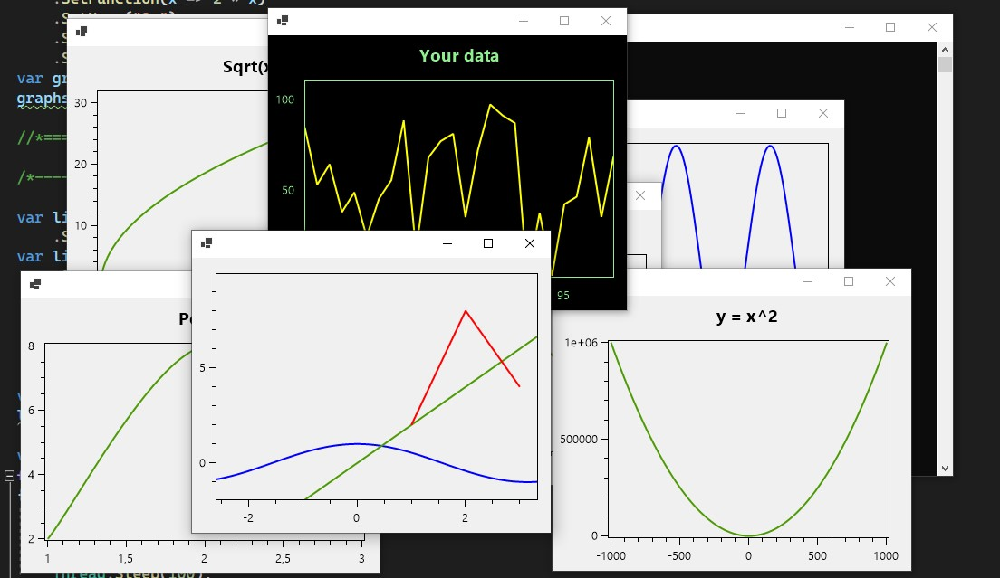

**<h1>Simple plotting library for net6.0-windows</h1>**

<h2>Quick build from console</h2><br>




+ Wrapper for [OxyPlot](https://github.com/oxyplot/oxyplot), but you don't need to download OxyPlot
+ Works only with windows forms and -windows target framework
+ [Samples](ConsoleExample/Program.cs)

<h2>How to start</h2>


1. [Download .dll](https://github.com/Gorddd/Charting.Window/releases/tag/v1.0)
2. Create new project

    ```
    dotnet new console --framework net6.0 -o name
    ```
3. Add "-windows" in TargetFramework; add "UseWindowsForms=true" line and references to .dll in .csproj

    .csproj should look like this
    ```xml
    <Project Sdk="Microsoft.NET.Sdk">
        <PropertyGroup>
            <OutputType>Exe</OutputType>
            <TargetFramework>net6.0-windows</TargetFramework>
            <ImplicitUsings>enable</ImplicitUsings>
            <Nullable>enable</Nullable>
            <UseWindowsForms>true</UseWindowsForms>
        </PropertyGroup>

        <ItemGroup>
            <Reference Include="Charting.Window.dll">
                <HintPath>YourPath\Charting.Window.dll</HintPath>
            </Reference>
        </ItemGroup>
    </Project>
    ```
4. Build the project
    ```
    dotnet build
    ```
5. Write [code](ConsoleExample/Program.cs) and run the project
    ```
    dotnet run
    ```
